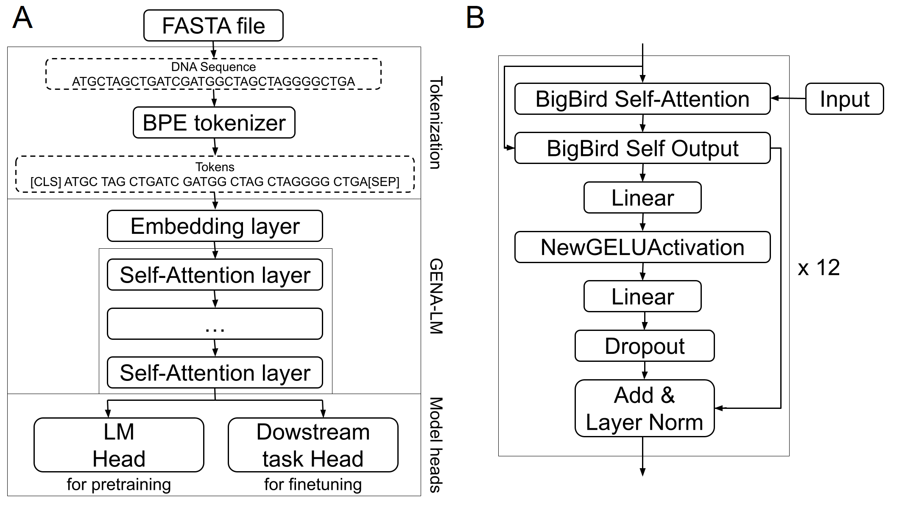

# Transformers for super enchancers classification
Super enhancers (SE) are long regulatory sequences in the genome. It has been shown that these elements largely determine the identity of cells both in the course of normal development and in pathology, influencing the expression of key genes. They are of interest for medicine, especially for understanding the mechanisms of development of tumors. Therefore, an important task prior to experimental validation is the search for these genetic elements using computational approaches. Most of the existing algorithms for their search require not only the DNA sequence, but also the data of expensive additional experiments. Our goal was to develop an algorithm for SE prediction that uses only information about the DNA sequence. We applied neural network models based on transformers. The results obtained by us in the future will help in the further development of methods for predicting super enhancers and the study of their structure. 
 
We performed [GENA-LM](https://github.com/AIRI-Institute/GENA_LM) fine-tuning.  
  
A -the GENA-LM transformer-based architecture diagram, based on doi.org/10.1101/2023.06.12.544594. B - BigBird self-attention layer  
 
 
Fine tuning was carried out first for the classifier, and then for all layers of the model for both models. The fine-tuning code can be found in GENA_LM.ipynb, the analysis of the results using cuptum is in ./explainability  
