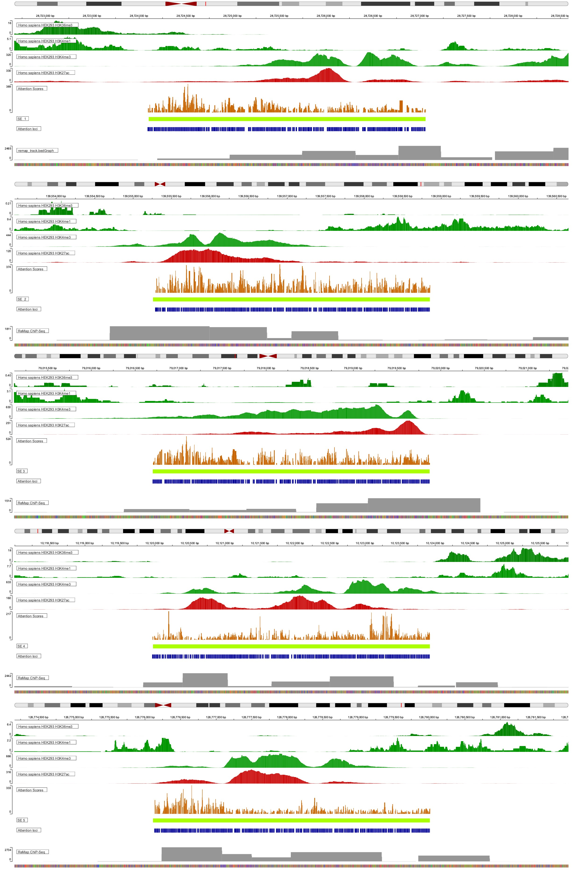

We used captum to get attribution sums, used to create bed files, observed in UCSC browser together with key SE marks  
In this repository you can find the code for HEK293. 
 
  
Visualization of intersection between epigenetic marks (dark-green and red) and model attention positive class subsequences (blue) for 5 SEs (light-green) from the HEK293 cell line.
